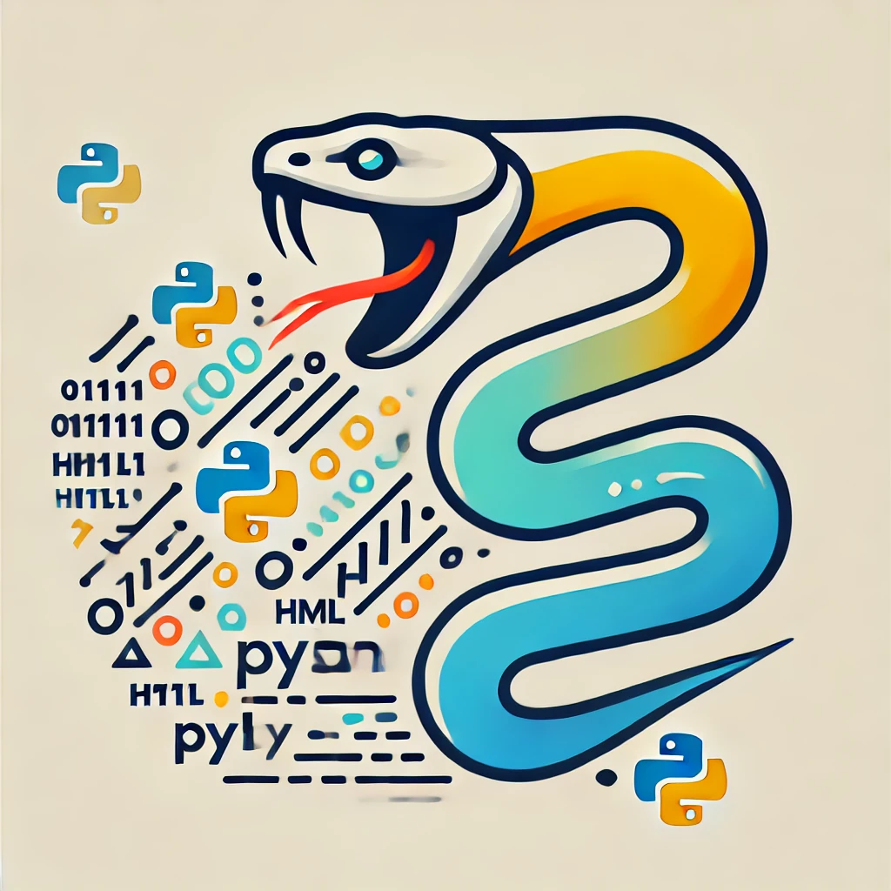

# Pythonik



Pythonik is a comprehensive Python SDK designed for seamless interaction with
the Iconik API. It offers a user-friendly interface to access various
functionalities of Iconik, making it easier for developers to integrate and
manage Iconik assets and metadata within their applications.

## Features

- Easy-to-use methods for accessing Iconik assets and metadata.
- Robust handling of API authentication and requests.
- Configurable timeout settings for API interactions.

## Installation

You can install Pythonik directly from PyPI:

```bash
pip install nsa-pythonik
```

If you're using Poetry:
```bash
poetry add nsa-pythonik
```

## Usage

### Get an Asset from Iconik

To retrieve an asset from Iconik, use the following code:

```python
from pythonik.client import PythonikClient
from pythonik.models.assets.assets import Asset
from pythonik.models.base import Response

app_id = secrets.get_secret("app_id")
auth_token = secrets.get_secret("auth_token")
asset_id = secrets.get_secret("asset_id")

client: PythonikClient = PythonikClient(app_id=app_id, auth_token=auth_token, timeout=10)


res: Response = client.assets().get(asset_id)
data: Asset = res.data
data_as_dict = data.model_dump()
data_as_json = data.model_dump_json()

```

### Get Metadata from a View

To get metadata for an asset from a specific view, use the following code:

```python
from pythonik.client import PythonikClient
from pythonik.models.assets.metadata import ViewMetadata
from pythonik.models.base import Response

app_id = secrets.get_secret("app_id")
auth_token = secrets.get_secret("auth_token")

asset_id = 'a31sd2asdf123jasdfq134'
view_id = 'a12sl34s56asdf123jhas2'

client: PythonikClient = PythonikClient(app_id=app_id, auth_token=auth_token, timeout=5)

default_model = ViewMetadata()
# intercept_404 intercepts 404 errors if no metadata is found in view and returns a ViewMetadata model you provide so you can handle the error gracefully
res: Response = client.metadata().get_asset_metadata(asset_id, view_id, intercept_404=default_model)
data: ViewMetadata = res.data
data_as_dict = data.model_dump()
data_as_json = data.model_dump_json()
```

### Connecting to Different Iconik Environments

By default, Pythonik connects to the standard Iconik environment (`https://app.iconik.io`). To connect to a different Iconik environment, you can specify the base URL when initializing the client:

```python
from pythonik.client import PythonikClient

client = PythonikClient(
    app_id=app_id,
    auth_token=auth_token,
    timeout=10,
    base_url="https://your-custom-iconik-instance.com"
)
```

This is useful when working with:
- AWS Iconik deployments
- Custom Iconik deployments (assuming this is possible)

Checkout the [API reference](./docs/API_REFERENCE.md) and [advanced usage guide](./docs/ADVANCED_USAGE.md) to see all you can do with Pythonik.

## Publishing to PyPI (for maintainers) 

To publish a new version to PyPI please see the [release how-to guide](./docs/RELEASE_HOW_TO.md).


## Using Poetry

This project uses Poetry for dependency management and packaging. Below are instructions on how to work with Poetry, create a Poetry shell, and run tests using pytest.

### Setting Up Poetry

First, install Poetry if you haven't already:

### Creating a Poetry Shell

To create and activate a Poetry shell, which sets up an isolated virtual environment for your project:

1. Navigate to your project directory.
2. Run the following command:

   ```sh
   poetry shell
   ```

This command will activate a virtual environment managed by Poetry. You can now run Python commands and scripts within this environment.

### Install all dependencies including pytest

```sh
    poetry install
```

### Running Tests with pytest

To run tests using pytest, follow these steps:

1. Inside the Poetry shell, run the tests with the following command:

   ```sh
   pytest
   ```

This will discover and execute all the tests in your project.

---

By following these steps, you can efficiently manage dependencies, create a virtual environment, and run tests in your Python project using Poetry.

## Support

For support, please contact NSA.

## Roadmap

Details about upcoming features and enhancements will be added here.

## Contributing

Please see the [contribution guide](./CONTRIBUTING.md) for information on how to contribute.

## Authors and Acknowledgment

This SDK is developed and maintained by North Shore Automation developers,
including Brant Goddard, Prince Duepa, Giovann Wah, and Brandon Dedolph.

## Contributors

## License

License information will be available soon.

## Project Status

Current project status and updates will be posted here.

